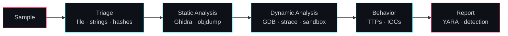

<!--
  7f 45 4c 46 02 01 01 00  |.ELF....|
  Se você está lendo isso, você abre binários e README por dentro.
  Próxima pista: procure o "não execute" no fim da página.
-->


<div align="center">
  <a href="https://git.io/typing-svg">
    
  </a>
</div>

<br>

<div align="center">


</div>

---

```console
rafael@lab:~$ cat /proc/self/status | head -5
Name:     rafisonrails
Role:     Malware Analysis · Reverse Engineering · Low-Level
Stack:    C/C++ · Linux · Ghidra · x86-64
State:    R (running)
Focus:    kernel internals, binary analysis, offensive/defensive security
```

---

## `> ./about_me`

Estudo **Ciência da Computação** com foco em **cibersegurança**. Passo meu tempo entendendo como os sistemas funcionam por baixo dos panos, do userland até o **kernel**.

Dissecto **executáveis**: leio código sem ter o fonte, sigo o fluxo de execução e analiso o que um malware faz no sistema. Escrevo em **C/C++**, vivo no **Linux** e faço engenharia reversa com **Ghidra**.

> *Não confie no que o programa diz que faz.*
> *Confie no que o binário faz.*

---

## `> ./focus --list`

<table>
<tr>
<td width="50%" valign="top">

### 🦠 Malware Analysis
- Análise estática e dinâmica
- Triagem e classificação de amostras
- Unpacking e desofuscação
- Identificação de TTPs
- Extração de IOCs
- Regras YARA

</td>
<td width="50%" valign="top">

### 🔩 Low-Level & Kernel
- Arquitetura x86-64 e ABI
- Syscalls: userland ↔ kernel
- ELF internals (headers, sections, GOT/PLT)
- Gerenciamento de memória
- Linux kernel & LKM
- Conceitos de rootkits e detecção

</td>
</tr>
<tr>
<td width="50%" valign="top">

### 🧬 Reverse Engineering
- Ghidra (decompiler, scripting)
- Análise de control flow
- Estruturas e vtables
- Anti-debug / anti-analysis
- Formatos e protocolos proprietários

</td>
<td width="50%" valign="top">

### 🛡️ Security
- Fundamentos de exploitation
- Mitigações: ASLR, NX, PIE, canary, RELRO
- Vulnerabilidades em C/C++
- Hardening de Linux
- Threat research

</td>
</tr>
</table>

---

## `> ./toolbox`

```text
┌──────────────────────┬───────────────────────────────────────────┐
│ Linguagens           │ C · C++ · x86-64 ASM · Ruby · Bash        │
├──────────────────────┼───────────────────────────────────────────┤
│ Reversing            │ Ghidra · GDB · objdump · readelf · strings│
├──────────────────────┼───────────────────────────────────────────┤
│ Tracing / Análise    │ strace · ltrace · perf · lsof             │
├──────────────────────┼───────────────────────────────────────────┤
│ Sistema              │ Linux · Kernel · Makefile · Git           │
└──────────────────────┴───────────────────────────────────────────┘
```

<div align="center">
  
</div>

---

## `> ./hello_syscall`

Sem libc, falando direto com o kernel.

```c
// write(1, "pwned by curiosity\n", 19); exit(0); — sem libc
static long sys3(long n, long a, long b, long c) {
    long ret;
    __asm__ volatile ("syscall"
        : "=a"(ret)
        : "a"(n), "D"(a), "S"(b), "d"(c)
        : "rcx", "r11", "memory");
    return ret;
}

void _start(void) {
    sys3(1,  1, (long)"pwned by curiosity\n", 19);  // SYS_write
    sys3(60, 0, 0, 0);                              // SYS_exit
}
```

```console
$ gcc -nostdlib -static -O1 -o hello hello.c && ./hello
pwned by curiosity
$ strace ./hello
write(1, "pwned by curiosity\n", 19)    = 19
exit(0)                                 = ?
```

---

## `> xxd /bin/ls | head -2`

```hexdump
00000000: 7f45 4c46 0201 0100 0000 0000 0000 0000  .ELF............
00000010: 0300 3e00 0100 0000 c06a 0000 0000 0000  ..>......j......
```

<sub>`7f 45 4c 46` → `\x7fELF`. Todo binário conta uma história.</sub>

---

## `> ./workflow`



> ⚠️ Toda análise de amostra roda em **ambiente isolado** (VM sem rede / sandbox). Sempre.

---

## `> ./roadmap`

- [x] C/C++ e fundamentos de baixo nível
- [x] Linux no dia a dia
- [x] Engenharia reversa com Ghidra
- [ ] Linux kernel modules (LKM) e internals
- [ ] Análise avançada de malware (unpacking, anti-analysis)
- [ ] Exploit development
- [ ] Regras YARA e detecções próprias
- [ ] Publicar write-ups e labs
- [ ] Achar todos os easter eggs deste README 🥚

---

## `> ./contact`

<div align="center">

<a href="mailto:Rafaeldematosf@gmail.com">
  
</a>
<a href="https://www.linkedin.com/in/rafael-ferreira-c137">
  
</a>
<a href="https://github.com/RafadeMatos">
  
</a>

<br><br>

```console
$ echo "Stay curious. Stay low-level." && exit 0
```

</div>

---

<details>
<summary>🥚 <code>sudo rm -rf / --no-preserve-root</code> <sub>(não execute)</sub></summary>

<br>

```console
[    0.000000] Linux version 6.x-rafael (gcc 13) #1 SMP PREEMPT
[    0.042069] Kernel panic - not syncing: curiosity overflow
[    0.042070] CPU: 0 PID: 1337 Comm: rafael Tainted: G  W  OE
[    0.042071] RIP: 0010:stay_curious+0x1f/0x40
[    0.042072] Code: 79 6f 75 5f 66 6f 75 6e 64 5f 74 68 65 5f 65 67 67
[    0.042073] ---[ end Kernel panic - not syncing: curiosity overflow ]---
```

😄 Brincadeira, nada foi apagado. Mas os bytes do campo `Code:` não são aleatórios...

<sub>Dica: <code>echo "&lt;hex&gt;" | xxd -r -p</code></sub>

<br>

<sub>🚩 flag (base64): <code>ZmxhZ3tyM3YzcnMzXzN2M3J5N2gxbmd9</code></sub>

</details>


